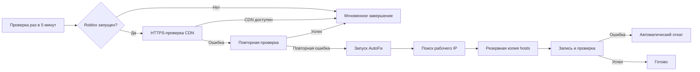

<div align="center">

[**Русский**](README.md) · [English](README_EN.md)

# Roblox CDN AutoFix

### Автоматическое восстановление доступа к Roblox CDN в Windows

[](https://www.microsoft.com/windows)
[](https://learn.microsoft.com/powershell/)
[](#требования)

**Проверяет CDN → находит рабочий IP → безопасно обновляет `hosts` → контролирует результат**

</div>

---

## Зачем это нужно

Иногда `tr.rbxcdn.com` перестаёт нормально открываться через текущий DNS-маршрут. Из-за этого Roblox может долго загружаться, терять соединение с CDN или не получать часть ресурсов.

Roblox CDN AutoFix самостоятельно:

- проверяет текущие IPv4-адреса CDN;
- получает свежие адреса через Google DoH и Cloudflare DoH;
- перебирает только проверенные HTTPS-подключением варианты;
- создаёт резервную копию системного файла `hosts`;
- записывает рабочий адрес и очищает DNS-кэш Windows;
- проверяет, что запрос действительно пошёл через новую запись;
- автоматически возвращает исходный `hosts`, если финальная проверка не прошла.

> [!IMPORTANT]
> Скрипт исправляет доступ только к `tr.rbxcdn.com`. Он не обходит блокировку самого Roblox и не исправляет проблемы провайдера, VPN, антивируса или брандмауэра.

## Быстрый старт

### Разовый запуск

1. Скачай проект и распакуй его в постоянную папку.
2. Запусти **`run-fix.cmd`**.
3. Подтверди запрос прав администратора.
4. Дождись результата проверки.

Скрипт ничего не записывает в `hosts`, пока не найдёт адрес, который отвечает по HTTPS.

### Автоматический режим

Запусти **`install-monitor.cmd`** и подтверди запрос контроля учётных записей. В Планировщике заданий Windows появится задача **`Roblox CDN AutoFix`**.

Для удаления автоматической проверки запусти **`uninstall-monitor.cmd`**.

> [!TIP]
> После перемещения папки проекта запусти `install-monitor.cmd` повторно — задача обновит путь к файлам.

## Как работает монитор



Монитор спроектирован так, чтобы не мешать работе компьютера:

| Состояние | Что происходит |
|---|---|
| Roblox закрыт | Выполняется только короткая нативная проверка процесса. PowerShell и сеть не используются |
| Roblox запущен | Один короткий HTTPS-запрос к CDN раз в пять минут |
| Первая ошибка | Через три секунды выполняется контрольная проверка |
| Две ошибки подряд | Запускается полная диагностика и подбор рабочего IP |
| Исправление уже запускалось | Следующая попытка разрешается только через 30 минут |

Задача работает с низким приоритетом, не запускает параллельные копии и не выводит фоновые окна.

## Безопасность

- **Проверка до изменения.** Каждый IP должен успешно пройти HTTPS-проверку с правильным доменом и TLS-сертификатом.
- **Прямое подключение.** Для диагностики `curl` не использует системный прокси, поэтому проверяется именно выбранный CDN-адрес.
- **Резервная копия.** Перед каждым изменением сохраняется исходный файл `hosts`.
- **Проверка после изменения.** Скрипт сверяет фактический удалённый IP с записанным адресом.
- **Автоматический откат.** Неудачное изменение отменяется, после чего DNS-кэш очищается повторно.
- **Без телеметрии.** Проект не собирает пользовательские данные и не отправляет статистику.

## Откуда берутся IP-адреса

Кандидаты проверяются по порядку:

1. Текущее разрешение имени средствами Windows.
2. Google DNS over HTTPS.
3. Cloudflare DNS over HTTPS.
4. Встроенный запасной список.

Запасные адреса не считаются доверенными автоматически — они проходят ту же HTTPS-проверку, что и адреса из DNS.

## Требования

- Windows 10 или Windows 11;
- Windows PowerShell 5.1 или новее;
- `curl.exe` — входит в актуальные версии Windows 10/11;
- права администратора для изменения `hosts` и установки задачи.

Дополнительные модули и сторонние программы не требуются.

## Структура проекта

| Файл | Назначение |
|---|---|
| `Roblox-CDN-AutoFix.ps1` | Основная диагностика, подбор IP, изменение и проверка `hosts` |
| `Roblox-CDN-Monitor.ps1` | Проверка CDN во время работы Roblox и запуск исправления |
| `Manage-AutoFixTask.ps1` | Установка, удаление и проверка задачи Планировщика |
| `run-monitor.cmd` | Лёгкая проверка процесса до запуска PowerShell |
| `run-fix.cmd` | Ручной запуск исправления |
| `install-monitor.cmd` | Установка автоматического режима |
| `uninstall-monitor.cmd` | Удаление автоматического режима |

## Логи и резервные копии

Все рабочие файлы сохраняются в:

```text
%ProgramData%\RobloxCDNAutoFix
```

| Путь | Содержимое |
|---|---|
| `RobloxCDNAutoFix.log` | Подробный журнал основной диагностики |
| `RobloxCDNMonitor.log` | Только ошибки CDN и результаты автоматических исправлений |
| `backups\hosts_*.bak` | Резервные копии файла `hosts` |
| `last-monitor-repair.txt` | Время последней автоматической попытки исправления |

## Коды завершения

| Код | Значение |
|---:|---|
| `0` | CDN работает или исправление успешно применено |
| `1` | Не найден `hosts` или `curl.exe` |
| `2` | Не удалось найти рабочий CDN-адрес |
| `3` | Ошибка изменения файла `hosts` |
| `4` | Финальная проверка не прошла; выполнена попытка отката |

## Частые вопросы

<details>
<summary><strong>Будет ли монитор нагружать компьютер?</strong></summary>

Нет. Пока Roblox закрыт, задача выполняет только быструю нативную проверку списка процессов. PowerShell и сетевые запросы в этом сценарии не запускаются.

</details>

<details>
<summary><strong>Почему используется Планировщик, а не Windows-служба?</strong></summary>

Постоянная служба держала бы отдельный процесс в памяти без реальной необходимости. Планировщик запускает короткую проверку по расписанию и полностью освобождает ресурсы после завершения.

</details>

<details>
<summary><strong>Что будет, если выбранный IP перестанет работать?</strong></summary>

При следующей двойной ошибке монитор снова запустит диагностику, получит свежие адреса через DoH и заменит запись только после успешной проверки нового кандидата.

</details>

<details>
<summary><strong>Можно ли запускать исправление вручную при установленном мониторе?</strong></summary>

Да. `run-fix.cmd` можно использовать в любой момент. Планировщик не создаёт параллельные экземпляры фоновой задачи.

</details>

## Отказ от ответственности

Проект не связан с Roblox Corporation. Используй его на свой риск и только на компьютере, которым имеешь право управлять.

---

<div align="center">

**Если проект оказался полезным — поставь ему ⭐ на GitHub.**

</div>
