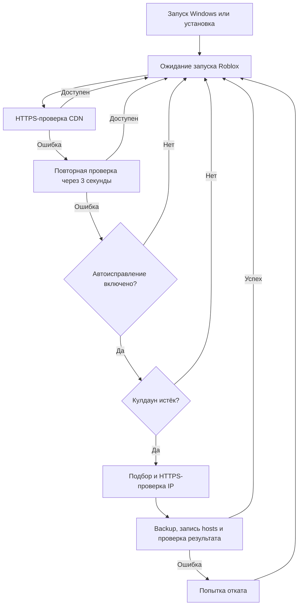

<div align="center">

# Roblox CDN AutoFix

### Roblox CDN recovery · Windows 10 / 11 x64


**Запуск Roblox → проверка CDN → подбор IP → безопасное обновление hosts**

[Русский](#russian) · [English](#english) · [Скачать / Download](https://github.com/forevertempest/Roblox-Fix-CDN/releases) · [Security](SECURITY.md)

Разработчик / Developer: **Tempest** · Discord: **foreverfame** · [Telegram: tempestdevelop](https://t.me/tempestdevelop)

</div>

---

<a id="russian"></a>

## Русский

[Начать](#start-ru) · [Меню](#menu-ru) · [Настройки](#settings-ru) · [Мониторинг](#monitor-ru) · [CLI](#cli-ru) · [Безопасность](#security-ru) · [Данные](#data-ru) · [FAQ](#faq-ru)

AutoFix помогает, когда `tr.rbxcdn.com` недоступен через текущий IP и Roblox не получает часть ресурсов. Программа проверяет HTTPS, ищет рабочий IPv4 и при необходимости добавляет собственную запись в системный `hosts`. Если CDN уже доступен, файл не меняется.

Поддерживается **только Windows x64**. Интерфейс и встроенная справка сейчас на русском; README — на русском и английском.

> [!IMPORTANT]
> Это не универсальное исправление Roblox. Проблемы аккаунта, серверов игры, провайдера, VPN или отсутствие интернета могут иметь другую причину. Успех проверки HTTPS не гарантирует загрузку каждого ресурса игры.

<a id="start-ru"></a>

## Быстрый старт

1. Скачай **[windows-x64.exe](https://github.com/forevertempest/Roblox-Fix-CDN/releases/latest/download/windows-x64.exe)**.
2. Запусти и выбери **1 — Проверить и исправить CDN**.
3. Подтверди UAC и дождись результата в основном окне.
4. Если hosts изменился, полностью перезапусти Roblox.

Это один самостоятельный EXE: рядом не нужны скрипты, DLL или установленный .NET Runtime. Для фонового режима выбери **2 → 1 — Установить / обновить**. Само открытие меню не устанавливает мониторинг.

> [!TIP]
> После скачивания новой версии закрой старое окно и открой новый EXE. Установленного наблюдателя обнови отдельно через **2 → 1**. После установки перезапусти уже открытую игру.

Требования: **Windows 10/11 x64**, встроенные **Windows PowerShell 5.1** и **curl.exe**, интернет для диагностики и права администратора для системных операций. Справка и пользовательские настройки работают без сети и UAC.

EXE не подписан сертификатом разработчика, поэтому SmartScreen может показать предупреждение. Сравни хеш с [SHA256SUMS.txt](https://github.com/forevertempest/Roblox-Fix-CDN/releases/latest/download/SHA256SUMS.txt):

```powershell
Get-FileHash .\windows-x64.exe -Algorithm SHA256
```

<a id="menu-ru"></a>

## Все функции меню

| Пункт | Что делает | Пример |
|---|---|---|
| **1 — Проверить и исправить CDN** | Немедленная диагностика и при необходимости ремонт; Roblox может быть закрыт | Контент не загружается — проверь CDN и прочитай результат |
| **2 — Настроить автопроверку** | Подменю: **1** установить / обновить, **2** удалить, **0** назад | Включить проверку при запуске игры или применить настройки |
| **3 — Изменить параметры** | Автоисправление, кулдаун, процессы, цвета | Оставить диагностику, отключив автоматический ремонт |
| **4 — Сбросить изменение hosts** | После подтверждения удалить свой блок и установленный мониторинг | Отменить изменения AutoFix, сохранив чужие строки |
| **5 — Состояние автопроверки** | Показать состояние задачи и путь к защищённому скрипту | Убедиться, что наблюдатель установлен |
| **6 — Информация** | Офлайн-справка с описаниями и примерами | Узнать, как работает кулдаун |
| **0 — Выход** | Закрыть меню | Установленный наблюдатель продолжит работать |

Ход операций, результаты и ошибки выводятся в основном окне, в том числе после UAC. Дополнительные консоли скрыты; системный запрос прав остаётся. Ошибка операции не закрывает интерактивное меню.

**Информация** содержит 12 тем: назначение AutoFix, ручной ремонт, установка/обновление/удаление, автоисправление, кулдаун, обнаружение запуска игры, процессы, оформление и сохранение настроек, сброс, статус, журналы/backup/безопасность и CLI. Выбери тему, нажми Enter для возврата или **0** для выхода в главное меню.

<a id="settings-ru"></a>

## Настройки и примеры

| Пункт параметров | По умолчанию в EXE | Назначение |
|---|---|---|
| **1 — Автоматическое исправление** | Включено | Разрешает ремонт при сбое CDN с учётом кулдауна; выключение оставляет диагностику и запись проблемы в журнал |
| **2 — Кулдаун ремонта** | 30 минут; диапазон 1–1440 | Минимальная пауза между попытками автоматического ремонта, включая неудачные |
| **3 — Названия процессов** | `RobloxPlayer,RobloxPlayerBeta,RobloxPlayerLauncher` | До восьми имён через запятую, без пути; суффикс `.exe` убирается |
| **4 — Цветовая схема** | `neon` | Переключение `neon → amber → mono`; влияет только на оформление |

**Кулдаун:** при значении 30 минут попытка ремонта в 12:00 запрещает следующую до 12:30. Запуск игры в 12:05 всё равно вызывает проверку CDN, но повторный ремонт пропускается. После 12:30 нужен новый запуск игры: окончание паузы само ничего не запускает.

**Ручной пункт 1** обходит кулдаун и настройку автоисправления. Выключение автоисправления не удаляет существующую запись hosts — для этого нужен сброс.

**Процессы:** например, `RobloxPlayerBeta,RobloxPlayerLauncher`. Сверь имена в Диспетчере задач → Подробности. Неверное имя помешает обнаружить игру, а имя другой программы будет вызывать проверку при её запуске.

**Оформление:** выбери `mono` для спокойной цветовой схемы. Цвета не влияют на частоту проверки и работу CDN.

> [!IMPORTANT]
> Настройки меню сохраняются для текущего пользователя. У наблюдателя отдельная копия: после изменения автоисправления, кулдауна или процессов выбери **2 → 1 — Установить / обновить**. Для смены цвета это не требуется.

Интервала опроса нет: Windows сообщает о запуске процесса через системное событие. Старые пользовательские JSON-настройки продолжают читаться; неизвестные поля игнорируются.

<a id="monitor-ru"></a>

## Как работает автопроверка

Установка создаёт задачу **Roblox CDN AutoFix**, запускает её сразу и настраивает запуск вместе с Windows. Один PowerShell-наблюдатель ждёт WMI-событие запуска выбранного процесса. Проверки CDN каждые пять минут нет.



| Ситуация | Поведение |
|---|---|
| Roblox закрыт | Ожидание события без сетевых запросов |
| Выбранный процесс запускается | Проверка CDN |
| Игра остаётся открытой | Повторных проверок по таймеру нет |
| Первая проверка не прошла | Контрольная проверка через 3 секунды |
| Две ошибки подряд | Ремонт, только если он включён и кулдаун истёк |
| События приходят во время проверки | Накопленные события объединяются, параллельные ремонты не запускаются |
| Игра открыта при установке | Нужно перезапустить Roblox для нового события |

Наблюдатель занимает память и работает с низким приоритетом. В ожидании нет периодического опроса процессов или сети; нулевая нагрузка не обещается. Планировщик запрещает параллельные экземпляры задачи и может перезапустить её после ошибки.

### Удаление и сброс

| Операция | Мониторинг и защищённая копия | Своя запись hosts | Backups и журналы |
|---|---|---|---|
| **2 → 2** / `monitor remove` | Удаляются | Остаётся | Сохраняются |
| **4** / `reset` | Удаляются | Удаляется; очищаются DNS-кэш и состояние кулдауна | Сохраняются |

Исходная папка проекта и скачанный EXE не удаляются. Сброс сохраняет чужие строки и не заменяет весь hosts старой копией. Изменения сторонних программ или старых версий вне собственного блока автоматически не восстанавливаются.

<a id="cli-ru"></a>

## Команды консоли

Из PowerShell в папке EXE:

```powershell
.\windows-x64.exe                         # Главное меню
.\windows-x64.exe fix                     # Проверить и исправить
.\windows-x64.exe check                   # Тоже может изменять hosts
.\windows-x64.exe monitor install         # Установить / обновить
.\windows-x64.exe monitor remove          # Удалить наблюдатель
.\windows-x64.exe monitor status          # Состояние задачи
.\windows-x64.exe status                  # То же состояние
.\windows-x64.exe settings                # Параметры
.\windows-x64.exe reset                   # Сброс с подтверждением
.\windows-x64.exe info                    # Подробная справка
.\windows-x64.exe help                    # Краткая справка
.\windows-x64.exe --version               # Версия
```

Без аргументов, с `menu` или `--menu` открывается меню. `monitor` без подкоманды показывает статус. `help`, `--help` и `-h` открывают краткую справку. `reset --yes` пропускает подтверждение сброса, но не UAC.

Установка с заданными параметрами:

```powershell
.\windows-x64.exe monitor install --cooldown 30 --auto-repair false --process-names "RobloxPlayer,RobloxPlayerBeta,RobloxPlayerLauncher"
```

`--cooldown` задаёт минуты, `--auto-repair` принимает `true`/`false`, `--process-names` — список имён. Аргументы меняют параметры текущего запуска; при установке сохраняются в конфигурации наблюдателя, но не переписывают пользовательские параметры меню. `--elevated` и `--output-pipe` используются самим EXE.

### Запуск из исходников

Распакуй весь репозиторий, сохранив CMD рядом с PS1:

| Запускатель | Действие |
|---|---|
| `run-fix.cmd` | Ручная диагностика и исправление с запросом прав |
| `install-monitor.cmd` | Установка / обновление защищённого наблюдателя |
| `uninstall-monitor.cmd` | Удаление наблюдателя без изменения hosts |
| `reset-autofix.cmd` | Сброс своего блока hosts и удаление мониторинга |
| `run-monitor.cmd` | Разовая проверка при открытом Roblox; не устанавливает фоновой режим |

Планировщик **не запускает CMD** — только защищённый PS1. Ручной `run-monitor.cmd` ищет `RobloxPlayerBeta`/`RobloxPlayerLauncher`; без прав администратора сообщает о сбое, но не исправляет его.

CMD-установщик использует собственные значения: `RobloxPlayerBeta`, 30 минут, автоисправление включено. Он не читает JSON EXE. Для настройки используй EXE или явные параметры:

```powershell
powershell.exe -NoProfile -ExecutionPolicy Bypass -File .\Manage-AutoFixTask.ps1 -Action Install -CooldownMinutes 30 -AutoRepair False -ProcessNames "RobloxPlayerBeta,RobloxPlayerLauncher"
```

<a id="security-ru"></a>

## Безопасность

- Только допустимые публичные IPv4; HTTPS и сертификат домена проверяются до записи.
- Управляется блок `# RobloxCDNAutoFix BEGIN` / `# RobloxCDNAutoFix END`. Чужая запись CDN или повреждённый блок останавливают изменение; чужие строки сохраняются.
- До изменения создаётся уникальный backup с SHA-256. Запись идёт через временный файл и атомарную замену с проверкой конкурентных изменений.
- После записи очищается DNS и проверяется фактический удалённый IP. Неудача вызывает попытку отката; обнаруженные параллельные изменения не перезаписываются вслепую.
- Файлы устанавливаются и проверяются до регистрации задачи. Повторная установка обновляет одну задачу, не создавая дубликатов.
- Defender, UAC, SmartScreen и firewall не отключаются. `ExecutionPolicy Bypass` действует только для отдельного процесса.

```text
Планировщик: Roblox CDN AutoFix
  → системный Windows PowerShell, SYSTEM / Highest
  → %ProgramFiles%\RobloxCDNAutoFix\versions\<версия>\Roblox-CDN-Monitor.ps1
```

SYSTEM нужен фоновому ремонту для записи системного hosts без UAC при каждом запуске игры. Задача использует абсолютные пути и не исполняет код из папки загрузки или репозитория. EXE извлекает встроенные скрипты в защищённую staging-папку и удаляет её после операции.

| Субъект | Права на установленный код и защищённые данные |
|---|---|
| SYSTEM | Полный доступ |
| Administrators | Полный доступ |
| Users | Чтение / выполнение, без записи и изменения ACL |

Проверяются владелец, ACL, reparse points и SHA-256-манифест runtime. Попытка обычного пользователя заменить установленный скрипт должна завершиться **Access Denied**. SYSTEM-задача не читает пользовательский JSON. Подробнее: [SECURITY.md](SECURITY.md).

### Сеть и приватность

Кандидаты берутся из системного DNS, Google DoH, Cloudflare DoH и запасного списка. Запасной IP тоже проходит HTTPS-проверку.

| Адрес | Назначение |
|---|---|
| `https://tr.rbxcdn.com/` | Проверка CDN и выбранных IP |
| `https://dns.google/resolve` | Google DoH; адрес подключения `8.8.8.8` |
| `https://cloudflare-dns.com/dns-query` | Cloudflare DoH; адрес подключения `1.1.1.1` |

Прямые диагностические запросы обходят системный прокси. Телеметрии нет: аккаунт Roblox, cookies, токены и содержимое файлов не отправляются. Сервер назначения при обычном соединении видит IP клиента. Сборка из исходников отдельно загружает пакеты из NuGet.

<a id="data-ru"></a>

## Настройки, журналы и backups

Пользовательские параметры: `%APPDATA%\Tempest\RobloxCDNAutoFix\settings.json`. Установленный код: `%ProgramFiles%\RobloxCDNAutoFix\versions\`.

Все системные данные ниже находятся в **`%ProgramData%\RobloxCDNAutoFix-Secure\`**:

| Файл / каталог | Содержимое |
|---|---|
| `monitor-settings.json` | Настройки установленного наблюдателя |
| `RobloxCDNAutoFix.log` | Диагностика и ремонт |
| `RobloxCDNMonitor.log` | События наблюдателя, проблемы и результаты ремонта |
| `Installer.log` | Установка, обновление, удаление и статус |
| `Console.log` | Ошибки EXE, если удалось записать их с системными правами |
| `last-monitor-repair.txt` | Время последней попытки автоматического ремонта |
| `backups\hosts_*.bak` и `.sha256` | Уникальные снимки hosts и контрольные суммы |

Каждый журнал ограничен примерно 1 МиБ плюс архив `.1`. Backups не перезаписываются и не удаляются при uninstall/reset; они могут накапливаться. Старые backups репозитория не трогаются и не используются для автоматического привилегированного отката. Новые копии находятся в защищённой системной папке, не рядом с EXE.

### Коды завершения

Для прямого запуска **`Roblox-CDN-AutoFix.ps1`**:

| Код | Значение |
|---:|---|
| `0` | CDN доступен или исправление выполнено |
| `1` | Ошибка прав, окружения, целостности или диагностики |
| `2` | Рабочий IP не найден |
| `3` | Ошибка изменения hosts |
| `4` | Финальная проверка не прошла; выполнена попытка отката |

EXE сообщает код дочернего PowerShell в тексте ошибки, но неудачную CLI-операцию завершает кодом `1`. Ошибка в меню не закрывает программу. У скрипта мониторинга отдельные значения: `2` — кулдаун, `3` — автоисправление выключено; таблица ремонта к ним не относится.

<a id="faq-ru"></a>

## Частые вопросы

<details>
<summary><strong>Почему HTTP 404 считается работающим CDN?</strong></summary>

Корень `/` CDN может не содержать страницы. Корректный HTTP-ответ через проверенное TLS-соединение подтверждает доступность сервера, а не существование конкретного ресурса Roblox.

</details>

<details>
<summary><strong>Мониторинг установлен, но не замечает игру</strong></summary>

Перезапусти Roblox: наблюдатель ждёт новое событие запуска. Проверь имена процессов и примени настройки через **2 → 1**. `Running` означает, что наблюдатель работает, а не что CDN уже исправлен.

</details>

<details>
<summary><strong>Можно ли закрыть меню или переместить EXE?</strong></summary>

Да. Задача работает с защищённой системной копией. Перемещение исходных файлов не требует переустановки; обновление кода или настроек наблюдателя требует **2 → 1**.

</details>

<details>
<summary><strong>Что делать, если выбранный IP перестал работать?</strong></summary>

Следующий запуск игры вызовет проверку. Ремонт произойдёт, если он разрешён и кулдаун истёк. Для немедленной диагностики используй **1**; для удаления своего блока — **4**.

</details>

<details>
<summary><strong>Почему Планировщик, а не отдельная служба?</strong></summary>

Он обеспечивает запуск вместе с Windows и повторный запуск после ошибки без установки отдельного сервиса. Наблюдатель — постоянный процесс, который занимает память; нулевая нагрузка не обещается.

</details>

## Сборка и проверки

Для сборки нужен **.NET 8 SDK**. Перед пересборкой закрой релизный EXE.

```powershell
powershell.exe -NoProfile -ExecutionPolicy Bypass -File .\build-release.ps1
powershell.exe -NoProfile -ExecutionPolicy Bypass -File .\tests\Test-Local.ps1
```

Сборка выпускает только `win-x64`: `release/windows-x64.exe` и `release/SHA256SUMS.txt`. Локальные тесты работают с фикстурами без изменения системного hosts.

| Проверка | Назначение и побочные эффекты |
|---|---|
| `tests/Test-ConsoleSettings.ps1` | Проверяет сохранение параметров и восстанавливает прежний пользовательский JSON |
| `tests/Test-ConsoleOutput.ps1` | Проверяет вывод статуса через UAC, UTF-8 и возврат в меню |
| `tests/Test-ConsoleOutput.ps1 -Install` | Дополнительно устанавливает / обновляет наблюдатель с пользовательскими параметрами |
| `tests/Test-InstalledSecurity.ps1` | Без повышения прав после установки проверяет отказ в записи и смене ACL |
| `tests/Test-Lifecycle.ps1` | Удаляет и переустанавливает мониторинг с повышением прав; меняет текущую установку |

Сценарии и ограничения — в [SECURITY.md](SECURITY.md).


## Публикация на GitHub

1. Загрузи в репозиторий исходники, CMD-запускатели, папки `console` и `tests`, `build-release.ps1`, `README.md`, `SECURITY.md` и `.gitignore`. При загрузке через браузер не выбирай папку `release`; Git исключает её автоматически.
2. Собери проект через `build-release.ps1`. В папке `release` будут **`windows-x64.exe`** и **`SHA256SUMS.txt`**.
3. На GitHub открой **Releases → Draft a new release**, выбери тег версии и прикрепи эти два файла.
4. Опубликуй релиз. Ссылки скачивания в этом README ведут к последнему опубликованному релизу и начнут работать после загрузки файлов с этими именами.

`windows-x64` обозначает платформу и архитектуру; номер версии задаётся тегом релиза. Пользователю для работы нужен только EXE, контрольная сумма — для проверки загрузки.

EXE загружается в **Releases**, не через обычный **Add file → Upload files**: веб-загрузка файла в репозиторий ограничена 25 МиБ. [Документация GitHub](https://docs.github.com/en/repositories/working-with-files/managing-files/adding-a-file-to-a-repository).

Кэши `console/bin`, `console/obj`, логи, резервные копии hosts и локальные настройки не публикуются. Исходные PS1 нужны для сборки встроенных ресурсов; CMD нужны для запуска из исходников; тесты нужны для проверки проекта.

## Структура проекта

| Путь | Назначение |
|---|---|
| `console/Program.cs` | Windows-меню, CLI, параметры, справка и передача вывода через UAC |
| `Roblox-CDN-AutoFix.ps1` | Диагностика, подбор IP, запись и проверка hosts |
| `Roblox-CDN-Monitor.ps1` | Обнаружение запуска игры и автоматический ремонт |
| `AutoFix.Common.ps1` | ACL, целостность, backups, транзакции, блокировки и ротация |
| `Manage-AutoFixTask.ps1` | Установка, статус, удаление и сброс |
| `*.cmd` | Ручные запускатели из исходников |
| `build-release.ps1` | Сборка самостоятельного Windows EXE |
| `release/` | Генерируемый EXE и SHA-256 для GitHub Releases; исключены из Git |
| `tests/` | Локальные и интеграционные проверки |

Проект не связан с Roblox Corporation. Используй его только на компьютере, которым имеешь право управлять.

---

<a id="english"></a>

## English

[Start](#start-en) · [Menu](#menu-en) · [Settings](#settings-en) · [Monitoring](#monitor-en) · [CLI](#cli-en) · [Security](#security-en) · [Data](#data-en) · [FAQ](#faq-en)

AutoFix helps when `tr.rbxcdn.com` is unreachable through its current IP and Roblox cannot fetch some resources. It checks HTTPS, finds a working IPv4 address, and adds its own system `hosts` entry when necessary. If the CDN is already reachable, hosts stays unchanged.

Only **Windows x64** is supported. The interface and built-in help are currently in Russian; this README is bilingual.

> [!IMPORTANT]
> This is not a universal Roblox fix. Account issues, game-server outages, ISP/VPN problems, and lack of internet access may need different solutions. Successful HTTPS does not guarantee every game resource loads.

<a id="start-en"></a>

## Quick start

1. Download **[windows-x64.exe](https://github.com/forevertempest/Roblox-Fix-CDN/releases/latest/download/windows-x64.exe)**.
2. Open it and select **1 — Check and repair CDN**.
3. Approve UAC and read the result in the same window.
4. Fully restart Roblox if hosts changed.

The release is one self-contained EXE: no adjacent scripts, DLLs, or separate .NET Runtime. Select **2 → 1 — Install / update** for background monitoring. Merely opening the menu does not install it.

> [!TIP]
> After downloading an update, close the old window and open the new EXE. Separately update the installed watcher with **2 → 1**. Restart an already-open game after installation.

Requirements: **Windows 10/11 x64**, built-in **Windows PowerShell 5.1** and **curl.exe**, internet for diagnostics, and administrator privileges for system operations. Help and user preferences need neither internet nor elevation.

The EXE is not code-signed; SmartScreen may display a warning. Compare its hash with [SHA256SUMS.txt](https://github.com/forevertempest/Roblox-Fix-CDN/releases/latest/download/SHA256SUMS.txt):

```powershell
Get-FileHash .\windows-x64.exe -Algorithm SHA256
```

<a id="menu-en"></a>

## Every menu function

| Item | Purpose | Example |
|---|---|---|
| **1 — Check and repair CDN** | Immediate diagnostics and repair if needed, even with Roblox closed | Investigate content that will not load |
| **2 — Configure monitoring** | Submenu: **1** install/update, **2** remove, **0** back | Enable launch-triggered checks or apply settings |
| **3 — Preferences** | Automatic repair, cooldown, processes, colors | Keep diagnostics but disable automatic repair |
| **4 — Reset hosts changes** | After confirmation, remove the owned block and monitoring | Undo AutoFix changes without deleting third-party lines |
| **5 — Monitoring status** | Display task state and protected script location | Verify watcher installation |
| **6 — Information** | Offline explanations and examples | Learn how cooldown works |
| **0 — Exit** | Close the console | Installed monitoring continues |

Operation output, results, and errors appear in the main window, including after elevation. Extra consoles are hidden; UAC remains. An operation error does not close the interactive menu.

Information contains 12 topics: purpose, manual repair, install/update/remove, automatic repair, cooldown, launch detection, process names, appearance/settings persistence, reset, status, logs/backups/security, and CLI. Choose a topic, press Enter to return, or **0** for the main menu.

<a id="settings-en"></a>

## Settings and examples

| Preferences item | EXE default | Purpose |
|---|---|---|
| **1 — Automatic repair** | Enabled | Allows repair after a CDN failure, subject to cooldown; disabling it retains diagnostics and failure logging |
| **2 — Repair cooldown** | 30 minutes; range 1–1440 | Minimum delay between automatic repair attempts, including failures |
| **3 — Process names** | `RobloxPlayer,RobloxPlayerBeta,RobloxPlayerLauncher` | Up to eight comma-separated names without paths; `.exe` is stripped |
| **4 — Color theme** | `neon` | Cycles `neon → amber → mono`; appearance only |

**Cooldown:** with 30 minutes configured, an attempt at 12:00 prevents another before 12:30. Launching at 12:05 still checks connectivity but skips another repair. A new game launch is needed after 12:30; expiry itself triggers nothing.

**Manual item 1** bypasses cooldown and the automatic-repair toggle. Disabling automatic repair does not remove an existing hosts entry; reset does.

**Processes:** for example, `RobloxPlayerBeta,RobloxPlayerLauncher`. Check names in Task Manager → Details. Wrong names prevent detection; another application's name triggers checks when that application starts.

**Appearance:** choose `mono` for subdued colors. Themes do not affect CDN behavior or check frequency.

> [!IMPORTANT]
> Menu preferences are saved per user. The watcher has a separate settings copy. After changing automatic repair, cooldown, or processes, select **2 → 1 — Install / update**. Theme changes do not require this.

There is no polling-interval setting: Windows supplies process-start events. Existing user JSON settings remain readable; unknown fields are ignored.

<a id="monitor-en"></a>

## How monitoring works

Installation creates **Roblox CDN AutoFix**, starts it immediately, and configures startup with Windows. One PowerShell watcher waits for WMI process-start events. There is no five-minute CDN polling.

| Situation | Behavior |
|---|---|
| Roblox is closed | Wait for events without network requests |
| A selected process starts | Check CDN connectivity |
| The game stays open | No repeated timer-based checks |
| First check fails | Confirmation check three seconds later |
| Both checks fail | Repair only if enabled and cooldown has expired |
| Events arrive during a check | Queued events are coalesced; no parallel repairs |
| The game was open during installation | Restart it to generate a new event |

Repair searches for an IP, validates HTTPS, creates a backup, writes hosts, flushes DNS, and verifies the result. Failure triggers a rollback attempt. The watcher uses memory and low CPU priority; zero overhead is not promised. Task Scheduler prevents duplicate instances and can restart it after failure.

### Removal versus reset

| Operation | Monitoring and protected copy | Owned hosts entry | Backups and logs |
|---|---|---|---|
| **2 → 2** / `monitor remove` | Removed | Kept | Kept |
| **4** / `reset` | Removed | Removed; DNS cache and cooldown state cleared | Kept |

The repository and downloaded EXE are not deleted. Reset preserves third-party lines and does not replace the whole file with an old backup. External changes, including changes by old versions outside the managed block, are not automatically reconstructed.

<a id="cli-en"></a>

## Command-line usage

From PowerShell in the EXE folder:

```powershell
.\windows-x64.exe                         # Main menu
.\windows-x64.exe fix                     # Check and repair
.\windows-x64.exe check                   # Also allowed to modify hosts
.\windows-x64.exe monitor install         # Install / update
.\windows-x64.exe monitor remove          # Remove watcher
.\windows-x64.exe monitor status          # Task status
.\windows-x64.exe status                  # Same status
.\windows-x64.exe settings                # Preferences
.\windows-x64.exe reset                   # Reset with confirmation
.\windows-x64.exe info                    # Detailed help
.\windows-x64.exe help                    # Brief help
.\windows-x64.exe --version               # Version
```

No arguments, `menu`, or `--menu` opens the menu. Bare `monitor` shows status. `help`, `--help`, and `-h` show brief help. `reset --yes` skips application confirmation, but not UAC.

Install with explicit settings:

```powershell
.\windows-x64.exe monitor install --cooldown 30 --auto-repair false --process-names "RobloxPlayer,RobloxPlayerBeta,RobloxPlayerLauncher"
```

`--cooldown` is in minutes, `--auto-repair` takes `true`/`false`, and `--process-names` takes comma-separated names. Overrides affect the current invocation; installation saves them for the watcher without overwriting user menu preferences. `--elevated` and `--output-pipe` are internal EXE options.

### Source launchers

Extract the repository with CMD and PS1 files together:

| Launcher | Action |
|---|---|
| `run-fix.cmd` | Manual diagnostics and repair, requesting elevation |
| `install-monitor.cmd` | Install/update the protected watcher |
| `uninstall-monitor.cmd` | Remove monitoring without changing hosts |
| `reset-autofix.cmd` | Remove the owned hosts block and monitoring |
| `run-monitor.cmd` | One check when Roblox is open; does not install monitoring |

Task Scheduler runs the protected PS1 directly, **not a CMD launcher**. Manual `run-monitor.cmd` looks for `RobloxPlayerBeta`/`RobloxPlayerLauncher`; without administrator rights it reports failures but does not repair them.

The CMD installer uses its own defaults: `RobloxPlayerBeta`, 30 minutes, repair enabled. It does not read the EXE's JSON. Customize installation through the EXE or explicit parameters:

```powershell
powershell.exe -NoProfile -ExecutionPolicy Bypass -File .\Manage-AutoFixTask.ps1 -Action Install -CooldownMinutes 30 -AutoRepair False -ProcessNames "RobloxPlayerBeta,RobloxPlayerLauncher"
```

<a id="security-en"></a>

## Security

- Only valid public IPv4 candidates; HTTPS and domain certificates are checked before writing.
- Only `# RobloxCDNAutoFix BEGIN` / `# RobloxCDNAutoFix END` is managed. Conflicting third-party CDN mappings or malformed blocks stop changes; foreign lines remain intact.
- Unique SHA-256-verified backups precede changes. Writes use temporary files, atomic replacement, and concurrent-change checks.
- DNS is flushed and the actual remote IP verified afterward. Failure triggers a rollback attempt; detected external edits are not blindly overwritten.
- Protected files are installed and verified before task registration. Reinstallation updates one task instead of creating duplicates.
- Defender, UAC, SmartScreen, and firewall remain enabled. `ExecutionPolicy Bypass` is process-local.

```text
Scheduled task: Roblox CDN AutoFix
  → system Windows PowerShell, SYSTEM / Highest
  → %ProgramFiles%\RobloxCDNAutoFix\versions\<version>\Roblox-CDN-Monitor.ps1
```

SYSTEM permits background hosts repair without UAC at every game launch. Absolute paths point to protected files, never the download or repository directory. The EXE extracts embedded scripts to protected staging and removes staging after the operation.

SYSTEM and Administrators have full control; Users have read/execute access without write or ACL-change rights. Owner, ACLs, reparse points, and runtime SHA-256 manifests are checked. An ordinary user's attempt to replace installed code must return **Access Denied**. The SYSTEM task does not read user preferences JSON. Details: [SECURITY.md](SECURITY.md).

### Network use and privacy

Candidates come from system DNS, Google DoH, Cloudflare DoH, and a fallback list. Fallback addresses still require HTTPS validation.

| Endpoint | Purpose |
|---|---|
| `https://tr.rbxcdn.com/` | CDN and candidate-IP checks |
| `https://dns.google/resolve` | Google DoH; bootstrap address `8.8.8.8` |
| `https://cloudflare-dns.com/dns-query` | Cloudflare DoH; bootstrap address `1.1.1.1` |

Direct diagnostics bypass the system proxy. No telemetry, Roblox account data, cookies, tokens, or file contents are uploaded. Destination servers naturally see the client IP. Building from source separately downloads dependencies from NuGet.

<a id="data-en"></a>

## Preferences, logs, and backups

User preferences: `%APPDATA%\Tempest\RobloxCDNAutoFix\settings.json`. Installed runtime: `%ProgramFiles%\RobloxCDNAutoFix\versions\`.

All system data below lives under **`%ProgramData%\RobloxCDNAutoFix-Secure\`**:

| File / directory | Contents |
|---|---|
| `monitor-settings.json` | Installed watcher settings |
| `RobloxCDNAutoFix.log` | Diagnostics and repair |
| `RobloxCDNMonitor.log` | Watcher events, failures, and repair results |
| `Installer.log` | Installation, updates, removal, and status |
| `Console.log` | EXE errors when writing elevated diagnostics succeeds |
| `last-monitor-repair.txt` | Latest automatic repair attempt |
| `backups\hosts_*.bak` and `.sha256` | Unique hosts snapshots and checksums |

Each log is bounded to approximately 1 MiB plus one `.1` archive. Backups are not overwritten or removed by uninstall/reset and may accumulate. Old repository backups remain untouched and are not trusted for automatic privileged rollback. New backups live in protected system storage, not beside the EXE.

### Exit codes

For direct **`Roblox-CDN-AutoFix.ps1`** execution:

| Code | Meaning |
|---:|---|
| `0` | CDN reachable or repair complete |
| `1` | Permission, environment, integrity, or diagnostic error |
| `2` | No working IP found |
| `3` | hosts modification error |
| `4` | Final verification failed; rollback attempted |

The EXE reports child PowerShell codes in error text but returns `1` for a failed CLI operation. Interactive failures leave the menu open. The monitor has separate meanings: `2` is cooldown, `3` is automatic repair disabled. Do not apply the repair table to those modes.

<a id="faq-en"></a>

## Frequently asked questions

<details>
<summary><strong>Why does HTTP 404 count as a reachable CDN?</strong></summary>

The root `/` may not contain a page. A valid HTTP response over verified TLS establishes server connectivity, not the existence of a particular Roblox resource.

</details>

<details>
<summary><strong>Monitoring is installed but ignores the game</strong></summary>

Restart Roblox to generate a new event. Verify process names and apply settings with **2 → 1**. `Running` describes the watcher, not an active CDN check or a successful repair.

</details>

<details>
<summary><strong>Can I close the menu or move the EXE?</strong></summary>

Yes. The task uses its protected system copy. Moving source files does not require reinstallation; updating watcher code or settings does require **2 → 1**.

</details>

<details>
<summary><strong>What if the selected IP stops working?</strong></summary>

The next launch checks again. Repair runs if enabled and cooldown has expired. Use **1** for immediate diagnostics or **4** to remove the managed block.

</details>

<details>
<summary><strong>Why Task Scheduler instead of a separate service?</strong></summary>

It handles startup and restart without installing a custom service. The watcher is a resident process that uses memory, not a promise of zero resource consumption.

</details>

## Building and validation

Building requires **.NET 8 SDK**. Close the release EXE before rebuilding.

```powershell
powershell.exe -NoProfile -ExecutionPolicy Bypass -File .\build-release.ps1
powershell.exe -NoProfile -ExecutionPolicy Bypass -File .\tests\Test-Local.ps1
```

Only `win-x64` is produced: `release/windows-x64.exe` and `release/SHA256SUMS.txt`. Local tests use fixtures without changing system hosts.

| Test | Purpose and side effects |
|---|---|
| `tests/Test-ConsoleSettings.ps1` | Checks persistence, then restores the original user JSON |
| `tests/Test-ConsoleOutput.ps1` | Checks status output through UAC, UTF-8, and menu return |
| `tests/Test-ConsoleOutput.ps1 -Install` | Also installs/updates monitoring using user preferences |
| `tests/Test-InstalledSecurity.ps1` | Run unelevated after installation; checks write and ACL-change denials |
| `tests/Test-Lifecycle.ps1` | Removes/reinstalls monitoring with elevation; changes the current installation |

See [SECURITY.md](SECURITY.md) for procedures and limitations.


## Publishing on GitHub

1. Upload the source scripts, CMD launchers, `console` and `tests` folders, `build-release.ps1`, `README.md`, `SECURITY.md`, and `.gitignore` to the repository. When uploading through the browser, omit `release`; Git excludes it automatically.
2. Run `build-release.ps1`. It produces **`release/windows-x64.exe`** and **`release/SHA256SUMS.txt`**.
3. Open **Releases → Draft a new release** on GitHub, select a version tag, and attach both files.
4. Publish the release. README download links point to the latest published release and work once assets with these names are uploaded.

`windows-x64` identifies platform and architecture; the release tag carries the version number. Users need only the EXE to run the application; the checksum verifies the download.

Upload the EXE to **Releases**, not ordinary **Add file → Upload files**: browser uploads to the repository are limited to 25 MiB per file. [GitHub documentation](https://docs.github.com/en/repositories/working-with-files/managing-files/adding-a-file-to-a-repository).

Do not publish `console/bin`, `console/obj`, logs, hosts backups, or local settings. PS1 source files are required to build embedded resources; CMD files support source-based usage; tests validate the project.

## Project structure

| Path | Purpose |
|---|---|
| `console/Program.cs` | Windows menu, CLI, preferences, help, and elevated-output relay |
| `Roblox-CDN-AutoFix.ps1` | Diagnostics, IP selection, hosts writing and verification |
| `Roblox-CDN-Monitor.ps1` | Process-start detection and automatic repair |
| `AutoFix.Common.ps1` | ACLs, integrity, backups, transactions, locks, and rotation |
| `Manage-AutoFixTask.ps1` | Install, status, removal, and reset |
| `*.cmd` | Source launchers |
| `build-release.ps1` | Self-contained Windows EXE build |
| `release/` | Generated EXE and SHA-256 for GitHub Releases; excluded from Git |
| `tests/` | Local and integration checks |

This project is not affiliated with Roblox Corporation. Use it only on computers you are authorized to manage.

---

<div align="center">

[Русский](#russian) · [English](#english) · [GitHub](https://github.com/forevertempest/Roblox-Fix-CDN) · [Telegram](https://t.me/tempestdevelop)

**Tempest · Discord: foreverfame**

</div>
