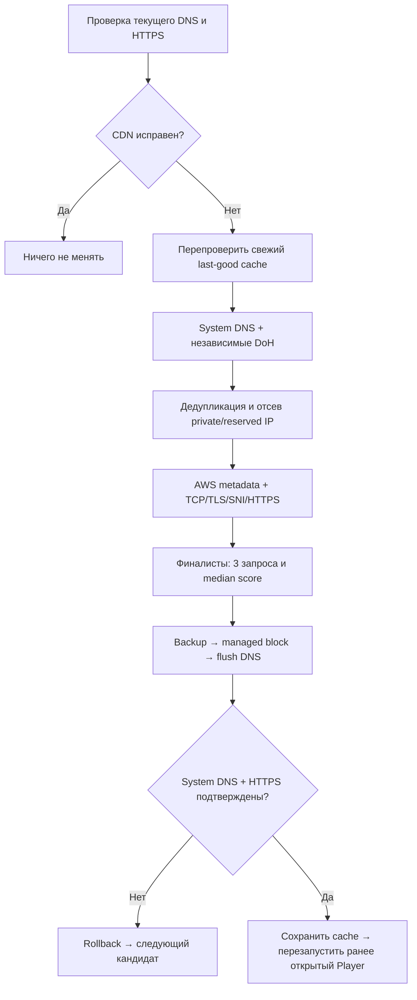

<div align="center">

# ⚡ Roblox CDN AutoFix v2

**Не вечный IP. Автоматический поиск рабочего CDN.**  
**Not a permanent IP. A repeatable CDN discovery algorithm.**

`Windows` · `x64 / ARM64` · `.NET 8` · `Single EXE` · `No telemetry`

**[Русский](#ru) · [English](#en) · [Release notes](RELEASES.md) · [Security](SECURITY.md)**

**Tempest** · Discord: `foreverfame` · [Telegram](https://t.me/tempestdevelop)

</div>

---

<a id="ru"></a>
## 🇷🇺 Русский

### Что изменилось

Раньше ремонт опирался на известные рабочие адреса и DNS. В v2 основа — повторяемый алгоритм: диагностика → динамическое обнаружение → проверка → выбор → безопасное применение → контроль результата. Встроенные IP остаются **только аварийным fallback**, когда динамические кандидаты не прошли проверку. Новый IP не требует нового релиза.

> AutoFix чинит доступ к настроенным CDN hostname, а не все ошибки Roblox. Он не восстанавливает аккаунты, игровые серверы или отсутствующее интернет-соединение. Успешный запрос к корню CDN не гарантирует доступность каждого отдельного asset.

### Быстрый старт

1. Скачай **`windows-x64.exe`** либо **`windows-arm64.exe`** из GitHub Releases под архитектуру Windows.
2. Запусти EXE: меню содержит ремонт, мониторинг, настройки, сброс, состояние, справку, диагностику и dry-run.
3. Для ремонта подтверди обычный запрос UAC. Лог возвращается в исходное окно; дополнительные консоли не нужны.

Рядом с EXE **не нужны** PowerShell-файлы или установленный .NET. Self-contained сборка содержит runtime. ARM64-сборка относится к AutoFix и сама по себе не гарантирует совместимость Roblox с конкретным устройством.

### Команды

```powershell
.\windows-x64.exe --diagnose
.\windows-x64.exe --dry-run --verbose
.\windows-x64.exe --repair
.\windows-x64.exe --repair --force --verbose
.\windows-x64.exe --restore
.\windows-x64.exe --repair --config "C:\My settings\config.json"
.\windows-x64.exe monitor install --config "C:\My settings\config.json"
.\windows-x64.exe monitor status
.\windows-x64.exe monitor remove
```

| Команда | Поведение |
|---|---|
| Без аргументов / `menu` | Интерактивное меню |
| `--diagnose` / `diagnose` | Текущие DNS, hosts override, TCP/TLS/HTTPS; без изменения hosts |
| `--dry-run` / `dry-run` | Полный поиск, тестирование и лучший кандидат; без записи hosts/cache и без перезапуска Player |
| `--repair` / `repair` / `fix` / `check` | Проверить, исправить только при проблеме; `check` сохраняет прежнюю семантику ремонта |
| `--restore` / `restore` | Удалить собственный блок; сторонние записи и мониторинг оставить |
| `reset` | С подтверждением восстановить стандартное разрешение hosts и удалить мониторинг; `--yes` пропускает подтверждение |
| `monitor install` | Установить/обновить защищённую копию и задачу |
| `monitor remove` | Удалить задачу и установленный код, **не** hosts, backups или исходники |
| `monitor status` / `status` | Состояние и абсолютный путь задачи |
| `settings` | AutoRepair, cooldown, имена отслеживаемых процессов, тема |
| `info` | Описание функций и примеры в консоли |
| `--verbose` | Источники/TTL, AWS, TCP/TLS/TTFB/total, score и причины отказа |
| `--force` | Полный поиск даже при исправном CDN; рабочий адрес не заменяется вариантом с худшей или равной median latency |
| `--config <file>` | Проверенная JSON-конфигурация v2; пример ниже |
| `--help`, `--version` | Справка и версия |

Для ARM64 замени имя EXE. `--verbose`, `--force`, `--config` идут **после команды**. Код выхода: `0` — успех, `1` — проблема/ошибка, `2` — неизвестная команда, `130` — отмена/общий timeout. Diagnose возвращает `1`, если CDN не подтверждён как исправный.

### Как выбирается адрес



- Свежий cached IP проходит три HTTPS-пробы; если он стабилен, полный discovery не требуется. Если финальная проверка cache-кандидата провалилась, выполняется динамический поиск.
- DNS возвращает **все A-записи**; источники и доступные TTL сохраняются. Системный .NET resolver TTL не сообщает. CNAME-цепочки ограничены по глубине и времени.
- По умолчанию: Cloudflare и Google DoH. Можно включить Quad9. Список ограничен реализованными публичными провайдерами: произвольные URL не принимаются.
- Google получает ECS `0.0.0.0/0`: подсеть пользователя в запрос не добавляется. [Описание Google](https://developers.google.com/speed/public-dns/docs/doh/json).
- До 24 кандидатов на этап discovery (настраивается до 50), 4 параллельные пробы (максимум 8), 5 финалистов, 3 запроса на финалиста. Не прошедший пробу IP немедленно отбрасывается.
- TCP: 3 s, DNS/DoH: 3 s, TLS: 5 s, HTTP: 5 s; общий сетевой бюджет операции 150 s. Откат и безопасное завершение процесса имеют дополнительные ограниченные таймауты.
- При неподтверждённой общей доступности двух DNS-сервисов ремонт прекращается без изменения hosts. Это осторожная диагностика, не доказательство полного отсутствия интернета: сервисы могут блокироваться отдельно.

### TLS, HTTP и AWS — без опасных сокращений

Прямой TCP идёт на candidate IP:443, но **SNI, Host и проверка сертификата используют target hostname**. Работает обычная проверка доверия, имени и срока сертификата Windows/.NET. Ни `-k`, ни отключения certificate validation нет.

HTTP 403/404 допустимы **только** при корректном TLS и распознанных CDN-заголовках. 5xx, 429, повреждённые ответы, неизвестные заголовки и TLS/network errors отклоняются. Пробы не скачивают asset: читаются заголовки с лимитом 32 KiB. `total` — время до получения заголовков; TCP, TLS и TTFB выводятся отдельно. Ping не участвует в решении.

Официальный [AWS ip-ranges.json](https://ip-ranges.amazonaws.com/ip-ranges.json) используется для поиска совпадения с `service=CLOUDFRONT`. **Диапазоны не сканируются.** CloudFront membership не означает совместимость с Roblox: TLS/HTTPS обязательны для каждого IP. Другие CDN могут пройти TLS/HTTPS без CloudFront metadata. Свежий cache AWS используется 24 часа; при ошибке обновления — старая копия с пометкой stale, без cache — работа без AWS metadata.

### Оценка и настройки

Скопируй [config.example.json](config.example.json), измени нужные значения и передай `--config`. Отсутствующие поля получают defaults; неизвестная schemaVersion, опасные hostname, чрезмерные лимиты и private IP отклоняются. Targets — только поддомены `rbxcdn.com`, каждый обрабатывается отдельно. Встроенный fallback можно отключить через `"fallback": {}`.

Формула для кандидата с **100% успешных проб**:

```text
score = 100
      + 4, если CloudFront verified
      + 2 × число дополнительных DNS-источников
      + 2, если найден в cache
      − 10 × median(total_ms) / 100
      − 3 × (max(total_ms) − min(total_ms)) / 100
```

Все веса находятся в `weights`. Любая неуспешная проба исключает кандидата независимо от AWS и score. Максимум три попытки применения. IPv4 реализован; модель явно указывает семейство адреса, CIDR-модуль понимает IPv6, но AAAA/IPv6 repair пока **не включён**.

Настройки обычного меню: `%APPDATA%\Tempest\RobloxCDNAutoFixV2\settings.json`. Они не исполняются как код. Установщик переносит проверенный config и параметры мониторинга в защищённые каталоги; задача не читает пользовательскую конфигурацию. После изменения параметров выполни `monitor install` заново. Если `--config` не указан при переустановке, используются defaults сетевого алгоритма.

### Фоновый AutoFix

`monitor install` создаёт задачу **Roblox CDN AutoFix v2**, которая при старте Windows запускает защищённый PowerShell-наблюдатель от SYSTEM/Highest. SYSTEM нужен для записи hosts без повторного UAC. Наблюдатель ждёт WMI-события запуска выбранного процесса, а не опрашивает CDN каждые пять минут. После установки уже открытый Roblox нужно запустить заново.

На событие: диагноз → при проблеме, включённом AutoRepair и истёкшем cooldown — общий `--repair`. Cooldown по умолчанию 30 минут, сохраняется между запусками наблюдателя; ограничивает **ремонт**, а не сетевую диагностику события. Ручной ремонт не ограничивается этим cooldown. События во время текущей операции объединяются, включая запуск Player после исправления.

Исполняемые файлы находятся только в `%ProgramFiles%\RobloxCDNAutoFixV2\versions\<id>\`. Задача использует абсолютный системный PowerShell, прямой `.ps1`, фиксированный native EXE и проверенный manifest SHA-256. Нет цепочки `cmd /c`. Owners — Administrators; SYSTEM/Administrators — FullControl, Users — ReadAndExecute. Нативные .NET-компоненты SYSTEM распаковываются в защищённый data-каталог. Не используй одновременно наблюдатели v1 и v2: перед переходом удали мониторинг v1 его старым EXE; исходники v1 здесь не изменены.

### Hosts, rollback и перезапуск Player

```text
# BEGIN ROBLOX-CDN-AUTOFIX
<проверенный IPv4> tr.rbxcdn.com
# END ROBLOX-CDN-AUTOFIX
```

Меняется только собственный блок. Чужая запись того же hostname блокирует автоматическую замену. Сохраняются комментарии, пустые строки, сторонние строки, BOM и переводы строк; поддерживаются UTF-8 и однобайтовые данные с точным byte round-trip. Неподдерживаемые кодировки, повреждённые/двойные блоки отвергаются. Парные маркеры v1 распознаются; старые одиночные неподписанные/датированные записи автоматически не присваиваются v2 — используй restore соответствующей версии.

Перед записью: уникальный backup + SHA-256 → recovery journal → временный файл рядом с hosts → atomic `File.Replace` с сохранением ACL. Проверяется исходный hash для обнаружения внешних изменений. После применения: `ipconfig /flushdns` → эффективный системный DNS должен вернуть выбранный IP → три TLS/HTTPS-пробы. Неуспех: восстановить предыдущие bytes, flush, контроль предыдущего состояния, отвергнуть IP и попробовать следующий.

При Ctrl+C сетевые операции отменяются и выполняется откат незавершённой транзакции. После аварийного убийства процесса/отключения питания journal восстанавливается **при следующем ремонтирующем запуске**. Изменённый другой программой hosts не затирается: операция останавливается для ручной проверки. Это optimistic conflict protection, не глобальная блокировка всех сторонних редакторов Windows.

Player запоминается до ремонта через API процессов. Порядок строго **APPLY → FLUSHDNS → VERIFY → RESTART**. Перезапускается только ранее открытый Player при реальном успешном изменении; не Studio, не при dry-run/healthy/failed. Общий post-fix restart выполняется один раз, каждый сохранённый Player — максимум один раз. Сначала корректное закрытие (5 s), затем при необходимости завершение с ограниченным ожиданием.

Используется тот же executable, проверяется подпись Roblox Corporation, PID/start time/session и исходный неповышенный пользовательский token. Player **не запускается от SYSTEM/admin**. Cookies, launch tickets и исходная command line не читаются. Игровая сессия не гарантируется; если путь/token/подпись недоступны, Player не закрывается. Ошибка запуска требует ручного открытия Roblox, но не отменяет успешный сетевой Fix.

### Логи, cache и privacy

`%ProgramData%\RobloxCDNAutoFixV2-Secure\`: `AutoFixV2.log`, `RobloxCDNMonitor.log`, `Installer.log`, `Console.log`, `candidates-v2.json`, `aws-ip-ranges.json`, `backups\`, recovery journal. Логи ротируются при 1 MiB с одной предыдущей копией. Backups не перезаписываются и сохраняются при удалении мониторинга.

**No telemetry. No analytics. No project backend.** Логи и диагностика разработчику не отправляются. Нет чтения Roblox credentials, изменения системного DNS, VPN/proxy, Defender, firewall, UAC или глобальной ExecutionPolicy. Локальный `ExecutionPolicy Bypass` используется только для встроенных проверенных PS-скриптов установщика/наблюдателя.

Внешние запросы: настроенные Roblox CDN hostname; `dns.google` (bootstrap `8.8.8.8`), `cloudflare-dns.com` (`1.1.1.1`), опционально `dns.quad9.net` (`9.9.9.9`); `ip-ranges.amazonaws.com`. Эти сервисы неизбежно видят исходный IP сетевого соединения. Локальный системный DNS использует настройки Windows. HTTPS-пробы идут напрямую без HTTP proxy; VPN-маршрутизация не меняется. Proxy/tunnel определяется только как факт и выводится предупреждение.

### Разработка и публикация

Windows + .NET 8 SDK; новые NuGet runtime-зависимости не добавлены.

```powershell
dotnet build console/RobloxCDNAutoFix.Console.csproj -warnaserror
dotnet format console/RobloxCDNAutoFix.Console.csproj --verify-no-changes
dotnet run --project tests/CoreTests/CoreTests.csproj
powershell -NoProfile -File tests/Test-Local.ps1
dotnet run --project tests/CoreTests/CoreTests.csproj -- --network
.\build-release.ps1
```

Обычные тесты не требуют интернета, прав администратора и не трогают настоящий Player/hosts. `--network` — отдельный opt-in TLS/DoH integration. `tests/Test-Lifecycle.ps1` с UAC проверяет install/update/uninstall, защищённые native hosts-fixtures и idle watcher; **переустанавливает мониторинг v2**, оставляет его установленным. После него обычным пользователем запусти `tests/Test-InstalledSecurity.ps1`: ожидается Access Denied при попытках записи кода и изменения задачи. Подробнее — [SECURITY.md](SECURITY.md).

Для нового репозитория/замены основной версии загружай **содержимое `version2` как корень**. Workflow `.github/workflows/ci.yml` становится активным только в корне репозитория. CI: build/analyzers, format, offline tests, PS safety tests, x64/ARM64 publish. Go race detector неприменим к .NET; workers ограничены, результаты принадлежат отдельным кандидатам, лог сериализован, изменения hosts защищены межпроцессным lock. Релизы — только EXE + необязательный SHA256SUMS; не загружай `bin`, `obj`, локальные cache/backups. Текст описания релиза: [RELEASES.md](RELEASES.md).

---

<a id="en"></a>
## 🇬🇧 English

### What changed

AutoFix v2 replaces dependence on a developer-maintained list with **diagnose → discover → validate → select → apply → verify → rollback if needed**. DNS and revalidated local results are primary; built-in addresses are emergency fallback only after dynamic candidates fail. No CloudFront range scanning, permanent-IP promises or developer backend.

Download `windows-x64.exe` or `windows-arm64.exe`. Run it for the interactive menu. Each executable is self-contained: no adjacent scripts or separately installed .NET required. ARM64 describes the utility build, not a guarantee that Roblox supports every ARM device. UAC is requested for repair/installation; elevated output returns to the original console.

### CLI

| Command | Purpose |
|---|---|
| `--diagnose` / `diagnose` | Current DNS, hosts override and TCP/TLS/HTTPS health; no hosts changes |
| `--dry-run` / `dry-run` | Discover, probe and rank; no hosts/cache writes or Player restart |
| `--repair` / `repair` / `fix` / `check` | Repair only if needed; legacy `check` still allows repair |
| `--restore` / `restore` | Remove owned hosts block, keep monitoring and user entries |
| `reset [--yes]` | Restore and uninstall monitoring; confirmation unless `--yes` |
| `monitor install` | Install/update protected background monitoring |
| `monitor remove` | Remove task/runtime; retain hosts, backups, logs and repository |
| `monitor status` / `status` | Show task status and paths |
| `settings`, `info`, `menu` | Preferences, feature guide and interactive console |
| `--verbose` | Detailed DNS/TTL, AWS, probes, timings, scores and rejection reasons |
| `--force` | Discover even when healthy; do not replace a healthy mapping with a slower/equal candidate |
| `--config <file>` | Validated v2 JSON, also accepted by `monitor install` |
| `--help`, `--version` | Help/version |

```powershell
.\windows-x64.exe --dry-run --verbose
.\windows-x64.exe --repair --config "C:\My settings\config.json"
.\windows-x64.exe monitor install --config "C:\My settings\config.json"
.\windows-x64.exe --restore
```

Options follow the command. Exit codes: success `0`, failed/unhealthy `1`, unknown command `2`, cancellation/overall timeout `130`. The menu exposes repair, monitoring, settings, restore, status, information, diagnose and dry-run.

### Discovery and validation

All system A records are collected; public DoH providers are Cloudflare/Google by default and optional Quad9. DNS origins, available TTLs and bounded CNAME chains are retained. The system .NET resolver does not expose TTL. Google requests use zero-length ECS to avoid supplying the user's subnet. Provider endpoints are allowlisted, not arbitrary URLs.

Only validated public IPv4 and `*.rbxcdn.com` targets are permitted. Private, loopback, metadata, shared, reserved and documentation IPs are rejected. Each configured hostname has independent diagnostics and managed mapping. IPv6 CIDR parsing is available, but AAAA discovery/IPv6 repair is not enabled.

TCP connects to the candidate IP; TLS uses the **Roblox hostname as SNI**, normal Windows/.NET certificate validation, and the same HTTP Host. Open port 443 or AWS membership alone is never sufficient. Recognized CDN responses can include 403/404; 5xx, 429, unknown fingerprints and TLS/network failures are rejected. Requests read bounded headers, not assets. `total` measures time through response headers; TCP, TLS and TTFB are separate. This does not prove every asset is available.

The official AWS JSON supplies only `CLOUDFRONT` prefix/region metadata; it is **never enumerated into addresses**. Membership is advisory and cannot bypass TLS. Other CDN networks can work without CloudFront metadata. AWS data is cached for 24 hours; a failed refresh uses stale metadata with a warning, or continues without metadata. A fresh last-good IP is still probed three times before use. If its final verification fails, dynamic discovery resumes.

Defaults: 24 candidates, 4 workers, 5 finalists, 3 requests each, at most 3 apply attempts. DNS/TCP timeouts are 3 seconds, TLS/HTTP 5 seconds, overall network budget 150 seconds. Cleanup/restart has separate bounded waits. Two independent DNS services provide a conservative connectivity check, not an absolute test of all internet access. HTTP proxies are detected but direct probes bypass them; VPN routing and system DNS settings are never changed.

### Configuration and scoring

See [config.example.json](config.example.json). Unspecified fields retain defaults; limits and schemaVersion are validated. Use `"fallback": {}` to disable emergency addresses. For completely successful samples:

```text
score = 100 + 4×CloudFront + 2×additional_DNS_sources + 2×cached
        − 10×median_total_ms/100 − 3×(max_total_ms−min_total_ms)/100
```

Weights are configurable. Any failed sample excludes the candidate regardless of score. Dynamic candidates are tried before fallback. `--force` cannot apply a candidate with worse/equal median than the healthy baseline. The selected IP is not permanent and is revalidated on later repairs.

Menu preferences live under `%APPDATA%\Tempest\RobloxCDNAutoFixV2\settings.json`. Installation copies validated network config and monitor settings into protected locations; SYSTEM never reads user-writable config. Reinstall to apply changes; reinstalling without `--config` uses network defaults.

### Monitoring and Player restart

The **Roblox CDN AutoFix v2** task runs a protected WMI process-start watcher at Windows startup, SYSTEM/Highest for hosts write access. It makes no periodic CDN requests while idle. Launching Roblox triggers diagnose, then repair if enabled and outside the cooldown (default 30 minutes, persisted across watcher restarts). Manual repairs ignore monitor cooldown. Events during one operation are coalesced. Restart an already-open Roblox after installing monitoring. Remove the v1 watcher before using v2; v1 sources remain untouched.

Player state is captured before repair. Order is strictly **APPLY → FLUSHDNS → VERIFY → RESTART**. Only previously running Player processes restart, only after actual verified changes, once per captured process in one post-fix phase. Studio is untouched. Graceful close gets 5 seconds, followed by bounded termination if necessary. PID/start time/session, the same executable and Roblox Corporation signature are checked. Launch uses the original non-elevated user token, never SYSTEM/admin. No cookies, tickets or original command line are read. If safe context cannot be obtained, Player stays open; launch failure does not undo a successful fix. Rejoining the game may be necessary.

### Hosts safety, storage and privacy

Only the `# BEGIN ROBLOX-CDN-AUTOFIX` / `# END ROBLOX-CDN-AUTOFIX` block is managed. Foreign entries/comments/blank lines/BOM/newlines are preserved, including byte round-tripping for UTF-8 and single-byte data. A foreign target override or malformed/duplicate block causes refusal. Paired v1 markers are recognized; older standalone dated markers should be restored using v1 first.

Unique backup + SHA-256 precede a protected recovery journal and atomic `File.Replace`. A hash conflict check prevents knowingly overwriting external edits; this is not a global lock on other Windows editors. Only actual changes trigger DNS flush. Final effective system DNS must return the selected IP and repeated HTTPS must pass; otherwise the prior snapshot is restored, flushed and checked before trying another candidate. Ctrl+C cancels probes and rolls back unfinished transactions. After a forced kill or power failure, recovery runs **on the next mutating invocation**. External changes stop automatic recovery rather than being overwritten.

Code: `%ProgramFiles%\RobloxCDNAutoFixV2\versions\<id>\`. Data: `%ProgramData%\RobloxCDNAutoFixV2-Secure\`. ACL owner Administrators; SYSTEM/Administrators FullControl; Users ReadAndExecute. Absolute system PowerShell runs a fixed protected script, then a manifest-verified native executable; no `cmd /c`. SYSTEM .NET extraction also uses protected storage. Installation failure cannot register a user-directory task. Reinstallation is idempotent.

Logs rotate at 1 MiB with one previous copy. Successful-address and AWS caches default to 24-hour TTL. Unique backups are retained, including on uninstall. **No telemetry. No analytics. No project backend.** No Defender exclusions, firewall/UAC disabling or global ExecutionPolicy changes. Process-local Bypass is limited to embedded installation/watcher scripts.

External connections: configured Roblox CDN targets; `dns.google`/`8.8.8.8`, `cloudflare-dns.com`/`1.1.1.1`, optionally `dns.quad9.net`/`9.9.9.9`; official `ip-ranges.amazonaws.com`. Local DNS follows Windows configuration. These services necessarily see the network connection's source IP; diagnostic files and user identifiers are not uploaded.

### Build, test, publish

Use Windows and .NET 8 SDK. No new third-party runtime packages. Commands are listed in the Russian development section above and work identically. Offline core tests use fake process/network/hosts backends; they never kill Roblox. `--network` explicitly enables live DoH/TLS checks. `Test-Lifecycle.ps1` reinstalls v2 monitoring and tests protected native file fixtures with UAC; afterwards run `Test-InstalledSecurity.ps1` **unelevated** to confirm Access Denied. See [SECURITY.md](SECURITY.md).

Publish the **contents of `version2` as repository root** to activate its GitHub workflow. CI performs build/analyzers, formatting, offline core/PowerShell tests and both Windows builds. Go's race detector is not applicable; workers are bounded, candidate state is isolated, log output serialized and hosts mutation protected by an exclusive process lock. Upload the standalone EXEs and optional SHA256SUMS to Releases, not build intermediates or local data. [Bilingual release description](RELEASES.md).
