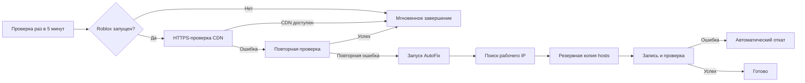
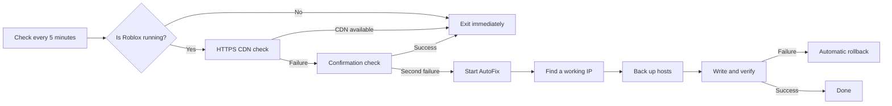

<div align="center">

[**Русский**](#russian) · [English](#english)

<a id="russian"></a>

# Roblox CDN AutoFix

### Автоматическое восстановление доступа к Roblox CDN в Windows

[](https://www.microsoft.com/windows)
[](https://learn.microsoft.com/powershell/)
[](#требования)

**Проверяет CDN → находит рабочий IP → безопасно обновляет `hosts` → контролирует результат**

</div>

---

## Зачем это нужно

Иногда `tr.rbxcdn.com` перестаёт нормально открываться через текущий DNS-маршрут. Из-за этого Roblox может долго загружаться, терять соединение с CDN или не получать часть ресурсов.

Roblox CDN AutoFix самостоятельно:

- проверяет текущие IPv4-адреса CDN;
- получает свежие адреса через Google DoH и Cloudflare DoH;
- перебирает только проверенные HTTPS-подключением варианты;
- создаёт резервную копию системного файла `hosts`;
- записывает рабочий адрес и очищает DNS-кэш Windows;
- проверяет, что запрос действительно пошёл через новую запись;
- автоматически возвращает исходный `hosts`, если финальная проверка не прошла.

> [!IMPORTANT]
> Скрипт исправляет доступ только к `tr.rbxcdn.com`. Он не обходит блокировку самого Roblox и не исправляет проблемы провайдера, VPN, антивируса или брандмауэра.

## Быстрый старт

### Разовый запуск

1. Скачай проект и распакуй его в постоянную папку.
2. Запусти **`run-fix.cmd`**.
3. Подтверди запрос прав администратора.
4. Дождись результата проверки.

Скрипт ничего не записывает в `hosts`, пока не найдёт адрес, который отвечает по HTTPS.

### Автоматический режим

Запусти **`install-monitor.cmd`** и подтверди запрос контроля учётных записей. В Планировщике заданий Windows появится задача **`Roblox CDN AutoFix`**.

Для удаления автоматической проверки запусти **`uninstall-monitor.cmd`**.

> [!TIP]
> После перемещения папки проекта запусти `install-monitor.cmd` повторно — задача обновит путь к файлам.

## Как работает монитор



Монитор спроектирован так, чтобы не мешать работе компьютера:

| Состояние | Что происходит |
|---|---|
| Roblox закрыт | Выполняется только короткая нативная проверка процесса. PowerShell и сеть не используются |
| Roblox запущен | Один короткий HTTPS-запрос к CDN раз в пять минут |
| Первая ошибка | Через три секунды выполняется контрольная проверка |
| Две ошибки подряд | Запускается полная диагностика и подбор рабочего IP |
| Исправление уже запускалось | Следующая попытка разрешается только через 30 минут |

Задача работает с низким приоритетом, не запускает параллельные копии и не выводит фоновые окна.

## Безопасность

- **Проверка до изменения.** Каждый IP должен успешно пройти HTTPS-проверку с правильным доменом и TLS-сертификатом.
- **Прямое подключение.** Для диагностики `curl` не использует системный прокси, поэтому проверяется именно выбранный CDN-адрес.
- **Резервная копия.** Перед каждым изменением сохраняется исходный файл `hosts`.
- **Проверка после изменения.** Скрипт сверяет фактический удалённый IP с записанным адресом.
- **Автоматический откат.** Неудачное изменение отменяется, после чего DNS-кэш очищается повторно.
- **Без телеметрии.** Проект не собирает пользовательские данные и не отправляет статистику.

## Откуда берутся IP-адреса

Кандидаты проверяются по порядку:

1. Текущее разрешение имени средствами Windows.
2. Google DNS over HTTPS.
3. Cloudflare DNS over HTTPS.
4. Встроенный запасной список.

Запасные адреса не считаются доверенными автоматически — они проходят ту же HTTPS-проверку, что и адреса из DNS.

## Требования

- Windows 10 или Windows 11;
- Windows PowerShell 5.1 или новее;
- `curl.exe` — входит в актуальные версии Windows 10/11;
- права администратора для изменения `hosts` и установки задачи.

Дополнительные модули и сторонние программы не требуются.

## Структура проекта

| Файл | Назначение |
|---|---|
| `Roblox-CDN-AutoFix.ps1` | Основная диагностика, подбор IP, изменение и проверка `hosts` |
| `Roblox-CDN-Monitor.ps1` | Проверка CDN во время работы Roblox и запуск исправления |
| `Manage-AutoFixTask.ps1` | Установка, удаление и проверка задачи Планировщика |
| `run-monitor.cmd` | Лёгкая проверка процесса до запуска PowerShell |
| `run-fix.cmd` | Ручной запуск исправления |
| `install-monitor.cmd` | Установка автоматического режима |
| `uninstall-monitor.cmd` | Удаление автоматического режима |

## Логи и резервные копии

Все рабочие файлы сохраняются в:

```text
%ProgramData%\RobloxCDNAutoFix
```

| Путь | Содержимое |
|---|---|
| `RobloxCDNAutoFix.log` | Подробный журнал основной диагностики |
| `RobloxCDNMonitor.log` | Только ошибки CDN и результаты автоматических исправлений |
| `backups\hosts_*.bak` | Резервные копии файла `hosts` |
| `last-monitor-repair.txt` | Время последней автоматической попытки исправления |

## Коды завершения

| Код | Значение |
|---:|---|
| `0` | CDN работает или исправление успешно применено |
| `1` | Не найден `hosts` или `curl.exe` |
| `2` | Не удалось найти рабочий CDN-адрес |
| `3` | Ошибка изменения файла `hosts` |
| `4` | Финальная проверка не прошла; выполнена попытка отката |

## Частые вопросы

<details>
<summary><strong>Будет ли монитор нагружать компьютер?</strong></summary>

Нет. Пока Roblox закрыт, задача выполняет только быструю нативную проверку списка процессов. PowerShell и сетевые запросы в этом сценарии не запускаются.

</details>

<details>
<summary><strong>Почему используется Планировщик, а не Windows-служба?</strong></summary>

Постоянная служба держала бы отдельный процесс в памяти без реальной необходимости. Планировщик запускает короткую проверку по расписанию и полностью освобождает ресурсы после завершения.

</details>

<details>
<summary><strong>Что будет, если выбранный IP перестанет работать?</strong></summary>

При следующей двойной ошибке монитор снова запустит диагностику, получит свежие адреса через DoH и заменит запись только после успешной проверки нового кандидата.

</details>

<details>
<summary><strong>Можно ли запускать исправление вручную при установленном мониторе?</strong></summary>

Да. `run-fix.cmd` можно использовать в любой момент. Планировщик не создаёт параллельные экземпляры фоновой задачи.

</details>

## Отказ от ответственности

Проект не связан с Roblox Corporation. Используй его на свой риск и только на компьютере, которым имеешь право управлять.

---

<div align="center">

**Если проект оказался полезным — поставь ему ⭐ на GitHub.**

</div>

---

<a id="english"></a>

<div align="center">

[Русский](#russian) · **English**

## English version

### Automatic Roblox CDN connectivity recovery for Windows

**Checks the CDN → finds a working IP → safely updates `hosts` → verifies the result**

</div>

## Why this project exists

Sometimes `tr.rbxcdn.com` stops responding correctly through the current DNS route. As a result, Roblox may take a long time to load, lose its CDN connection, or fail to download some resources.

Roblox CDN AutoFix automatically:

- checks the IPv4 addresses currently returned for the CDN;
- retrieves fresh addresses through Google DoH and Cloudflare DoH;
- considers only candidates that pass a direct HTTPS test;
- creates a backup of the system `hosts` file;
- writes the working address and flushes the Windows DNS cache;
- verifies that requests actually use the new mapping;
- restores the original `hosts` file if the final check fails.

> [!IMPORTANT]
> This script only repairs connectivity to `tr.rbxcdn.com`. It does not bypass a Roblox block and cannot fix every ISP, VPN, antivirus, or firewall issue.

## Quick start

### One-time repair

1. Download the project and extract it to a permanent folder.
2. Run **`run-fix.cmd`**.
3. Approve the administrator permission request.
4. Wait for the diagnostic result.

The script does not write anything to `hosts` until it finds an address that successfully responds over HTTPS.

### Automatic mode

Run **`install-monitor.cmd`** and approve the User Account Control prompt. A task named **`Roblox CDN AutoFix`** will appear in Windows Task Scheduler.

To remove automatic monitoring, run **`uninstall-monitor.cmd`**.

> [!TIP]
> If you move the project folder, run `install-monitor.cmd` again so the scheduled task receives the new path.

## How the monitor works



The monitor is designed to stay out of the way:

| State | What happens |
|---|---|
| Roblox is closed | Only a short native process check runs. PowerShell and the network are not used |
| Roblox is running | One short HTTPS request to the CDN every five minutes |
| First failure | A confirmation check runs three seconds later |
| Two consecutive failures | Full diagnostics and working-IP selection begin |
| A repair was recently attempted | The next attempt is delayed for 30 minutes |

The task runs at low priority, prevents overlapping instances, and does not display background windows.

## Safety

- **Validation before modification.** Every IP must pass an HTTPS test with the correct domain and TLS certificate.
- **Direct connection.** Diagnostic `curl` requests bypass the system proxy, ensuring that the selected CDN address is actually tested.
- **Automatic backup.** The original `hosts` file is saved before every change.
- **Post-change verification.** The script compares the actual remote IP with the address written to `hosts`.
- **Automatic rollback.** A failed change is reverted and the DNS cache is flushed again.
- **No telemetry.** The project does not collect user data or send usage statistics.

## Where the IP addresses come from

Candidates are checked in the following order:

1. The address currently resolved by Windows.
2. Google DNS over HTTPS.
3. Cloudflare DNS over HTTPS.
4. The built-in fallback list.

Fallback addresses are not trusted automatically. They must pass the same HTTPS validation as DNS-provided addresses.

## Requirements

- Windows 10 or Windows 11;
- Windows PowerShell 5.1 or newer;
- `curl.exe`, included with current Windows 10/11 releases;
- administrator privileges to update `hosts` and install the scheduled task.

No additional modules or third-party applications are required.

## Project structure

| File | Purpose |
|---|---|
| `Roblox-CDN-AutoFix.ps1` | Main diagnostics, IP selection, `hosts` modification, and verification |
| `Roblox-CDN-Monitor.ps1` | CDN monitoring while Roblox is running and automatic repair startup |
| `Manage-AutoFixTask.ps1` | Scheduled-task installation, removal, and status checks |
| `run-monitor.cmd` | Lightweight process check before PowerShell starts |
| `run-fix.cmd` | Manual repair launcher |
| `install-monitor.cmd` | Automatic-mode installer |
| `uninstall-monitor.cmd` | Automatic-mode uninstaller |

## Logs and backups

All working files are stored in:

```text
%ProgramData%\RobloxCDNAutoFix
```

| Path | Contents |
|---|---|
| `RobloxCDNAutoFix.log` | Detailed log from the main diagnostic script |
| `RobloxCDNMonitor.log` | CDN failures and automatic repair results only |
| `backups\hosts_*.bak` | Backups of the `hosts` file |
| `last-monitor-repair.txt` | Time of the most recent automatic repair attempt |

## Exit codes

| Code | Meaning |
|---:|---|
| `0` | The CDN works or the repair completed successfully |
| `1` | The `hosts` file or `curl.exe` could not be found |
| `2` | No working CDN address was found |
| `3` | The `hosts` file could not be updated |
| `4` | Final verification failed and rollback was attempted |

## Frequently asked questions

<details>
<summary><strong>Will the monitor slow down my computer?</strong></summary>

No. While Roblox is closed, the task only performs a fast native process check. PowerShell and network requests are not started in this scenario.

</details>

<details>
<summary><strong>Why use Task Scheduler instead of a Windows service?</strong></summary>

A permanent service would keep a separate process in memory without providing a practical benefit. Task Scheduler runs a short check on schedule and releases all resources when it finishes.

</details>

<details>
<summary><strong>What happens if the selected IP stops working?</strong></summary>

After two consecutive failures, the monitor starts diagnostics again, retrieves fresh addresses through DoH, and replaces the mapping only after a new candidate passes validation.

</details>

<details>
<summary><strong>Can I run a manual repair while the monitor is installed?</strong></summary>

Yes. You can run `run-fix.cmd` at any time. Task Scheduler prevents duplicate background-task instances.

</details>

## Disclaimer

This project is not affiliated with Roblox Corporation. Use it at your own risk and only on computers you are authorized to manage.

---

<div align="center">

[Back to Russian](#russian) · [Back to top](#roblox-cdn-autofix)

**If this project helped you, consider giving it a ⭐ on GitHub.**

</div>
